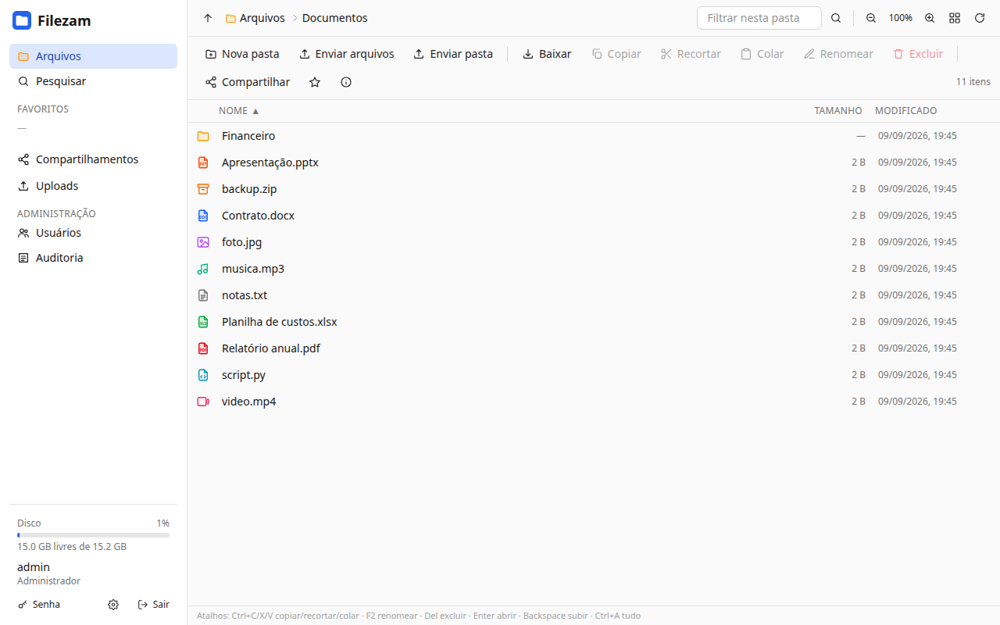
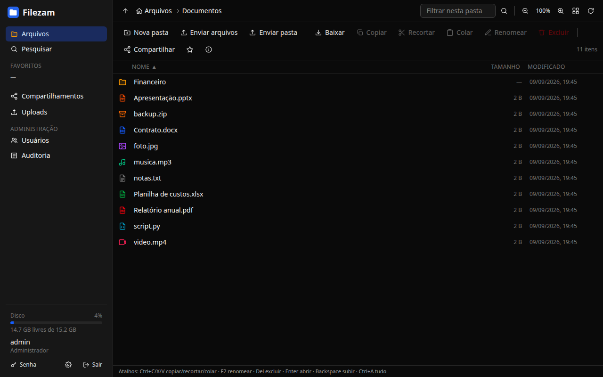

# Filezam

> Fast, secure self-hosted web file manager: expose one folder of your server through the browser, with users, huge resumable uploads and expiring public links. A single Go binary with the UI embedded, built to run in a container behind your reverse proxy.

[](https://github.com/miguelzamberlan/filezam/actions/workflows/ci.yml)


[](LICENSE)

[🇧🇷 Português](README.md) · 🇬🇧 English

<p align="center">
  
  
</p>

> The full documentation (`docs/`) is written in Brazilian Portuguese. The UI is available in English and Portuguese. Issues and pull requests in English are welcome.

## Why

Filezam started from a concrete need: an external drive attached to a home Linux server, shared on the LAN over Samba, that had to be reachable from the internet by family and clients, each seeing only their own folder. Existing options were heavy, needed an external database, or treated filesystem safety as an afterthought.

Three priorities drive every decision, in this order:

1. **Security.** Reading or writing outside the exposed folder is impossible: every disk access goes through Go's `os.Root`, which validates each path component in the kernel, symlinks included. No uploaded file can run script in another user's browser. Passwords, sessions and 2FA secrets are never stored in clear text.
2. **Speed.** Streaming I/O without buffering files in memory, few requests for many small files, parallel chunked uploads, long operations in the background with progress.
3. **Operational simplicity.** One container, configured by environment variables, no external database, no shell in the image, no root.

It is a personal, free and open-source project. It fits home servers, small offices and anyone who wants to hand files to clients without relying on third-party services. It is **not** a sync client, a document editor or a WebDAV/S3 server.

## Features

- **Users and scopes**: admin/user roles; each account sees the whole root or one subfolder as if it were the root.
- **Full management**: browse, create folders, rename, copy, cut/paste (move), delete, download file or ZIP, favorites, properties (computed size, item count, active links), free disk space.
- **Search** by name across every subfolder the user can reach, served by a SQLite name index and verified on disk.
- **Trash** with configurable retention and restore to the original place; `Shift+Del` deletes permanently.
- **Previews** for images, video, audio, PDF, text and rendered Markdown.
- **Serious uploads**: multi-GB files in parallel resumable chunks, whole folders by drag and drop, thousands of small files batched, all with a progress panel, pause and retry.
- **Public links**: share a folder or a file read-only with an expiry, optional password, access count and instant revocation.
- **Two-factor authentication** (TOTP) with recovery codes and "trust this device for 30 days"; optionally mandatory for admins.
- **Administration**: users with disk quotas and 2FA reset, audit log, progressive brute-force lockout, job history, Prometheus metrics.
- **UI**: Portuguese or English, light/dark/system theme, custom colors, list zoom, per-type icons, drag and drop to move, paginated listing for huge folders, keyboard shortcuts, comfortable on phones.
- **Operations**: static binary, `distroless` image without a shell, read-only rootfs, embedded SQLite (no CGO), automatic migrations, healthcheck.

## Quick start

Requirements: Docker with Compose v2.

```bash
git clone https://github.com/miguelzamberlan/filezam.git && cd filezam
cp .env.example .env
# in .env: PUID/PGID (id -u / id -g), FILEZAM_HOST_ROOT (folder to expose), FILEZAM_SECURE_COOKIES=false (no HTTPS yet)
docker compose up -d --build
```

Open `http://127.0.0.1:8080`, log in with `admin` / `admin` (or `FILEZAM_ADMIN_USER` / `FILEZAM_ADMIN_PASSWORD`) and change the password (mandatory on first login).

### Without Docker

Requires Go (version in `go.mod`) and Node 22+:

```bash
make web && make build
FILEZAM_ROOT=$HOME/Files FILEZAM_DATA_DIR=$HOME/.filezam FILEZAM_SECURE_COOKIES=false ./filezam
```

### On a server behind a reverse proxy

The container listens on `127.0.0.1:8080`; put an HTTPS proxy in front and tell Filezam about it:

```ini
# .env
PUID=1000
PGID=1000
FILEZAM_HOST_ROOT=/mnt/data
FILEZAM_HOST_CONFIG=/opt/filezam/config     # database + secret.key, outside the exposed folder
FILEZAM_TRUSTED_PROXIES=127.0.0.1           # where X-Forwarded-* headers come from
FILEZAM_SECURE_COOKIES=true
FILEZAM_PUBLIC_URL=https://files.example.com
FILEZAM_ADMIN_PASSWORD=change-me
FILEZAM_REQUIRE_2FA_ADMINS=true
```

The proxy must not limit or buffer request bodies. Caddy works out of the box (`reverse_proxy 127.0.0.1:8080`); nginx needs `client_max_body_size 0; proxy_request_buffering off; proxy_buffering off; proxy_read_timeout 600s;` plus `Host`, `X-Forwarded-For` and `X-Forwarded-Proto`. Traefik: raise the entrypoint `readTimeout`. Cloudflare: keep the upload chunk at or below 64 MiB (the 16 MiB default is fine).

### On Easypanel

Create an **App** service from the GitHub repository (build: Dockerfile), set the environment (`FILEZAM_TRUSTED_PROXIES=10.0.0.0/8,172.16.0.0/12`, `FILEZAM_SECURE_COOKIES=true`, `FILEZAM_PUBLIC_URL`, `FILEZAM_ADMIN_PASSWORD`, `FILEZAM_REQUIRE_2FA_ADMINS=true`), mount a named volume at `/config` and a bind mount of the host folder at `/data` (writable by uid `65532`, or use the *Compose* service type with `user: "uid:gid"`), add your domain on port `8080` with HTTPS and deploy. Step by step (in Portuguese) in [`docs/08-operacao.md`](docs/08-operacao.md#3-no-easypanel).

## Configuration

| Variable | Default | Description |
|---|---|---|
| `FILEZAM_ROOT` | `/data` (image) / `./data` | Root folder of the files |
| `FILEZAM_DATA_DIR` | `/config` (image) / `./config` | Database and `secret.key`. Must be outside `FILEZAM_ROOT` |
| `FILEZAM_LISTEN` | `:8080` | Listen address |
| `FILEZAM_TRUSTED_PROXIES` | empty | Comma-separated IPs/CIDRs of the reverse proxy |
| `FILEZAM_SECURE_COOKIES` | `auto` | `true` / `false` / `auto` (from `X-Forwarded-Proto` of a trusted proxy) |
| `FILEZAM_PUBLIC_URL` | empty | Base of public links (`https://...`); the UI uses the browser origin when empty |
| `FILEZAM_ADMIN_USER` / `FILEZAM_ADMIN_PASSWORD` | `admin` / `admin` | Admin created on first start (change forced) |
| `FILEZAM_SESSION_TTL` | `168h` | Sliding session lifetime (absolute cap: 30 days) |
| `FILEZAM_MAX_UPLOAD_CHUNK` | `16MiB` | Upload chunk size (1 MiB–1 GiB) |
| `FILEZAM_SHARE_MAX_TTL` | `720h` | Maximum lifetime of a public link |
| `FILEZAM_TRASH_RETENTION` | `720h` | Time in the trash before permanent removal; `0` disables the trash |
| `FILEZAM_INDEX_INTERVAL` | `6h` | Full rescan of the search name index; `0` disables the index |
| `FILEZAM_METRICS_TOKEN` | empty | Enables `GET /metrics` (Prometheus) with `Authorization: Bearer` |
| `FILEZAM_SECRET_KEY` | empty | 64-hex key encrypting 2FA secrets; empty = `/config/secret.key` generated on first start |
| `FILEZAM_REQUIRE_2FA_ADMINS` | `false` | Force administrators to enable two-factor authentication |
| `FILEZAM_FSYNC` | `true` | `fsync` before finalizing each upload |
| `FILEZAM_LOG_LEVEL` | `info` | `debug`, `info`, `warn`, `error` |

The compose `.env` also has `PUID`/`PGID`, `FILEZAM_HOST_ROOT`, `FILEZAM_HOST_CONFIG`, `FILEZAM_BIND` and `FILEZAM_PORT`.

## Security in short

- **Path sandbox**: every disk access goes through `os.Root`; `..`, escaping symlinks and internal names (`.filezam-*`) are rejected on input, reads included. Tests keep a canary file outside the root and assert no operation reaches it.
- **User content never becomes a page**: HTML/JS/SVG-as-text are served as `text/plain`, everything else as a download; inline previews carry a `sandbox` CSP and `nosniff`; Markdown is rendered client-side with raw HTML dropped.
- **Sessions**: `HttpOnly` + `SameSite=Strict` cookie, only the hash stored, sliding lifetime capped at 30 days; Argon2id passwords; progressive lockout and rate limits on login **and** password change; TOTP 2FA with AES-GCM encrypted secrets and replay protection.
- **CSRF**: custom `X-Filezam: 1` header required on every mutating request, plus `Sec-Fetch-Site`/`Origin` checks.
- **Headers**: strict CSP on the SPA, `X-Frame-Options`, `Referrer-Policy: same-origin`, HSTS behind a trusted HTTPS proxy; share tokens never reach the logs.
- **Resources**: per-user disk quota, caps on concurrent zips, jobs, searches and uploads, rate limits on public routes.
- **Container**: distroless, no shell, non-root, read-only rootfs, `cap_drop ALL`, `no-new-privileges`. Go version pinned; `govulncheck` and `npm audit` run in CI.

Threat model, controls and accepted limitations: [`docs/03-seguranca.md`](docs/03-seguranca.md). Reporting a vulnerability: [`SECURITY.md`](SECURITY.md).

## Development

```bash
make run     # API on :8080 serving ./data (cookies without Secure)
make dev     # Vite on :5173 proxying /api to :8080
make web     # frontend build into internal/server/webdist/dist
make build   # ./filezam binary with the embedded UI
make test    # go test ./... + tsc + vitest
make vuln    # govulncheck + npm audit
```

`cmd/` and `internal/` hold the Go side (`vfs` is the security core, `server` the HTTP handlers, `store` SQLite, `uploads` the upload protocol, `jobs` background operations); `web/` is the React 19 + TypeScript + Vite + Tailwind 4 frontend embedded via `go:embed`. Scripted API calls need the `X-Filezam: 1` header.

Contributions: read [`CONTRIBUTING.md`](CONTRIBUTING.md) (in Portuguese; the non-negotiable rules are the ones listed above under Security). Known limitations and next steps: [`docs/10-roadmap.md`](docs/10-roadmap.md).

## Author and license

**Miguel Zamberlan** ([@miguelzamberlan](https://github.com/miguelzamberlan)) is the author and maintainer. Developed in spare time with the help of AI tools for review and implementation; every change goes through automated tests and manual verification before reaching `main`.

[MIT](LICENSE) © 2026 Miguel Zamberlan.
