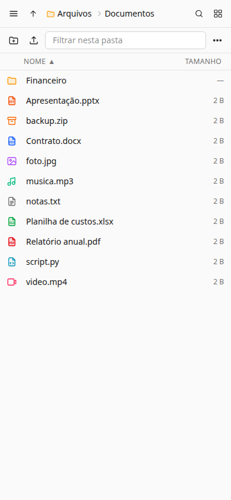

# Filezam

> Gestor de arquivos web auto-hospedado, rápido e seguro: exponha uma pasta do seu servidor pelo navegador, com usuários, uploads grandes com retomada e links públicos temporários. Um único binário Go com a interface embutida, feito para rodar num container atrás do seu proxy reverso.

[](https://github.com/miguelzamberlan/filezam/actions/workflows/ci.yml)


[](LICENSE)

🇧🇷 Português · [🇬🇧 English](README.en.md)

<p align="center">
  
  
</p>

## Sumário

- [Por que existe](#por-que-existe)
- [Funcionalidades](#funcionalidades)
- [Como rodar](#como-rodar)
  - [Na sua máquina em um minuto](#na-sua-máquina-em-um-minuto)
  - [Sem Docker](#sem-docker)
  - [Em um servidor, atrás de um proxy](#em-um-servidor-atrás-de-um-proxy)
  - [No Easypanel](#no-easypanel)
- [Configuração](#configuração)
- [Como usar](#como-usar)
- [Segurança](#segurança)
- [Documentação](#documentação)
- [Desenvolvimento](#desenvolvimento)
- [Contribuindo](#contribuindo)
- [Roadmap e limitações](#roadmap-e-limitações)
- [Autor e licença](#autor-e-licença)

## Por que existe

O Filezam nasceu de uma necessidade concreta: um HD externo ligado a um servidor Linux em casa, compartilhado na rede local por Samba, que precisava ficar acessível pela internet para a família e para clientes, cada um vendo só a sua pasta. As alternativas prontas eram pesadas, exigiam banco de dados externo ou tratavam a segurança do sistema de arquivos como detalhe.

Três prioridades guiam cada decisão, nesta ordem:

1. **Segurança.** É impossível ler ou escrever fora da pasta exposta: todo acesso ao disco passa pelo `os.Root` do Go, que valida cada componente do caminho no kernel, inclusive symlinks. Nenhum arquivo enviado por um usuário consegue executar script no navegador de outro. Senhas, sessões e segredos de 2FA nunca ficam em texto puro no banco.
2. **Velocidade.** I/O em streaming sem carregar arquivos na memória, poucas requisições para muitos arquivos pequenos, uploads em blocos paralelos e operações longas em segundo plano com progresso.
3. **Simplicidade de operação.** Um container, configurado por variáveis de ambiente, sem banco externo, sem shell na imagem, rodando sem root.

É um projeto pessoal, gratuito e de código aberto. Serve bem para servidores domésticos, pequenos escritórios e quem quer entregar arquivos a clientes sem depender de serviços de terceiros. O que ele **não** pretende ser: um Dropbox com sincronização, um editor de documentos ou um servidor WebDAV/S3.

## Funcionalidades

- **Usuários e escopos**: login com usuário e senha, perfis administrador/usuário, cada conta com acesso à raiz inteira ou a uma subpasta que ela enxerga como se fosse a raiz.
- **Gerenciamento completo**: navegar, criar pastas, renomear, copiar, recortar/colar (mover), excluir, baixar arquivo ou ZIP, favoritos, propriedades (tamanho calculado, quantidade de itens, links ativos) e espaço livre em disco.
- **Pesquisa** por nome em todas as subpastas às quais o usuário tem acesso, respondida por um índice em SQLite (varredura periódica) e conferida no disco.
- **Lixeira** com retenção configurável e restauração ao lugar original. `Shift+Del` apaga de vez.
- **Visualização** de imagens, vídeo, áudio, PDF, texto e Markdown formatado sem sair da página.
- **Uploads sérios**: arquivos de vários GB em blocos paralelos com retomada, pastas inteiras por arrastar e soltar, milhares de arquivos pequenos em lote, tudo com painel de progresso, pausa e repetição de falhas.
- **Links públicos**: compartilhe uma pasta ou um arquivo por link somente leitura com prazo de validade, senha opcional, contagem de acessos e revogação imediata.
- **Verificação em duas etapas** (TOTP) com códigos de recuperação e "confiar neste dispositivo por 30 dias"; opcionalmente obrigatória para administradores.
- **Administração**: usuários com cota de disco e redefinição de 2FA, auditoria de logins e alterações, bloqueio progressivo contra força bruta, histórico de operações e métricas Prometheus.
- **Interface**: português ou inglês, tema claro/escuro/sistema, cores personalizáveis, zoom da listagem, ícones por tipo, arrastar e soltar para mover, listagem paginada para pastas enormes, atalhos de teclado e uso confortável no celular.
- **Operação**: binário estático, imagem `distroless` sem shell, rootfs somente leitura, SQLite embutido (sem CGO), migrações automáticas, healthcheck.

<p align="center">
  
</p>

## Como rodar

Todos os cenários, com proxies (nginx, Caddy, Traefik, Cloudflare Tunnel), systemd, backup e diagnóstico, estão em [`docs/08-operacao.md`](docs/08-operacao.md). Aqui vai o essencial de cada um.

### Na sua máquina em um minuto

Requisitos: Docker com Compose v2.

```bash
git clone https://github.com/miguelzamberlan/filezam.git && cd filezam
cp .env.example .env
# no .env: PUID/PGID (id -u / id -g), FILEZAM_HOST_ROOT (pasta a expor) e FILEZAM_SECURE_COOKIES=false (sem HTTPS)
docker compose up -d --build
```

Acesse `http://127.0.0.1:8080`. Login inicial: `admin` / `admin` (ou o que estiver em `FILEZAM_ADMIN_USER` / `FILEZAM_ADMIN_PASSWORD`); a troca de senha é obrigatória no primeiro acesso. Os dados ficam em `./data` e o banco em `./config`.

### Sem Docker

Requisitos: Go (versão em `go.mod`) e Node 22+.

```bash
make web && make build     # frontend + binário ./filezam com a UI embutida
FILEZAM_ROOT=$HOME/Arquivos FILEZAM_DATA_DIR=$HOME/.filezam FILEZAM_SECURE_COOKIES=false ./filezam
```

Um único binário, sem dependências em tempo de execução. Para rodar como serviço há um exemplo de unidade systemd com endurecimento em [`docs/08-operacao.md`](docs/08-operacao.md#4-binário-direto-com-systemd).

### Em um servidor, atrás de um proxy

O cenário para o qual o Filezam foi feito: o container escuta só em `127.0.0.1` e um proxy com HTTPS fica na frente.

```bash
sudo mkdir -p /opt/filezam && cd /opt/filezam
git clone https://github.com/miguelzamberlan/filezam.git . && cp .env.example .env
```

```ini
# .env
PUID=1000                                  # dono da pasta de dados (id -u)
PGID=1000
FILEZAM_HOST_ROOT=/mnt/dados               # pasta exposta
FILEZAM_HOST_CONFIG=/opt/filezam/config    # banco + secret.key, fora da pasta exposta
FILEZAM_TRUSTED_PROXIES=127.0.0.1          # de onde vêm os X-Forwarded-*
FILEZAM_SECURE_COOKIES=true
FILEZAM_PUBLIC_URL=https://arquivos.exemplo.com
FILEZAM_ADMIN_PASSWORD=troque-esta-senha
FILEZAM_REQUIRE_2FA_ADMINS=true
```

```bash
docker compose up -d --build && docker compose logs -f filezam
```

No proxy, o corpo das requisições não pode ser limitado nem bufferizado. Caddy funciona sem ajustes (`reverse_proxy 127.0.0.1:8080`); nginx precisa de:

```nginx
location / {
    proxy_pass http://127.0.0.1:8080;
    proxy_http_version 1.1;
    client_max_body_size 0;
    proxy_request_buffering off;
    proxy_buffering off;
    proxy_read_timeout 600s;
    proxy_set_header Host $host;
    proxy_set_header X-Forwarded-For $proxy_add_x_forwarded_for;
    proxy_set_header X-Forwarded-Proto $scheme;
}
```

Traefik na mesma rede Docker: use os `labels` comentados no `docker-compose.yml` e aumente o `readTimeout` do entrypoint. Cloudflare (proxy laranja ou Tunnel): mantenha o chunk em até 64 MiB (o padrão de 16 MiB já serve).

### No Easypanel

O Easypanel constrói a imagem a partir do repositório e coloca o Traefik dele na frente com HTTPS automático:

1. **+ Service → App**. *Source*: GitHub, repositório `miguelzamberlan/filezam`, branch `main`. *Build*: Dockerfile.
2. **Environment**:
   ```ini
   FILEZAM_TRUSTED_PROXIES=10.0.0.0/8,172.16.0.0/12
   FILEZAM_SECURE_COOKIES=true
   FILEZAM_PUBLIC_URL=https://arquivos.exemplo.com
   FILEZAM_ADMIN_PASSWORD=troque-esta-senha
   FILEZAM_REQUIRE_2FA_ADMINS=true
   ```
3. **Mounts**: um *Volume Mount* em `/config` (nasce gravável, a pasta já existe na imagem com o uid `65532`) e um *Bind Mount* da pasta do host em `/data`, gravável pelo uid `65532` (`sudo chown -R 65532:65532 /mnt/dados`).
4. **Domains**: seu domínio na porta `8080` com HTTPS.
5. **Deploy** e login com `admin` + a senha da variável.

Se a pasta de dados pertence a outro usuário (compartilhada com Samba, por exemplo), use o tipo *Compose* do Easypanel com o `docker-compose.yml` do repositório e `user: "uid:gid"` do dono. Detalhes em [`docs/08-operacao.md`](docs/08-operacao.md#3-no-easypanel).

## Configuração

### Pastas e permissões

| Volume | Conteúdo |
|---|---|
| `${FILEZAM_HOST_ROOT}` → `/data` | Pasta raiz exibida pelo gestor. Para expor várias pastas do host, monte-as como subpastas: `- /mnt/midia:/data/midia`. |
| `${FILEZAM_HOST_CONFIG}` → `/config` | Banco SQLite (usuários, sessões, links, lixeira, índice, auditoria) e `secret.key` (2FA). Nunca é servido e não pode ficar dentro de `/data`. Faça backup da pasta inteira. |

O container roda sem root, como `PUID:PGID`, e as duas pastas precisam ser graváveis por esse usuário. Como o Docker cria pastas de *bind mount* inexistentes como `root`, o compose traz um serviço `init` (Alpine, executa uma vez) que ajusta o dono de `/config` e dos arquivos do Filezam dentro dela (nunca recursivamente, e ele se recusa a mexer numa pasta que tenha subpastas, para um `FILEZAM_HOST_CONFIG` errado não alterar uma árvore inteira do host) e, só se `/data` estiver vazia, também dela. Ele nunca altera o dono de uma pasta de dados que já tenha conteúdo. Se a pasta não for gravável, o app encerra na inicialização com o `chown` sugerido. Nunca use `PUID=0`.

### Variáveis de ambiente

| Variável | Padrão | Descrição |
|---|---|---|
| `FILEZAM_ROOT` | `/data` (imagem) / `./data` | Pasta raiz dos arquivos |
| `FILEZAM_DATA_DIR` | `/config` (imagem) / `./config` | Banco de dados e `secret.key`. Não pode ficar dentro de `FILEZAM_ROOT` |
| `FILEZAM_LISTEN` | `:8080` | Endereço de escuta |
| `FILEZAM_TRUSTED_PROXIES` | vazio | IPs/CIDRs do proxy reverso, separados por vírgula |
| `FILEZAM_SECURE_COOKIES` | `auto` | `true` / `false` / `auto` (detecta via `X-Forwarded-Proto` de proxy confiável) |
| `FILEZAM_PUBLIC_URL` | vazio | Base dos links públicos (`https://...`); sem ela a interface usa o endereço do navegador |
| `FILEZAM_ADMIN_USER` / `FILEZAM_ADMIN_PASSWORD` | `admin` / `admin` | Admin criado no primeiro início (troca forçada) |
| `FILEZAM_SESSION_TTL` | `168h` | Validade deslizante da sessão (teto absoluto: 30 dias) |
| `FILEZAM_MAX_UPLOAD_CHUNK` | `16MiB` | Tamanho do bloco de upload (1 MiB–1 GiB) |
| `FILEZAM_SHARE_MAX_TTL` | `720h` | Validade máxima de um link público |
| `FILEZAM_TRASH_RETENTION` | `720h` | Tempo na lixeira antes de apagar de vez; `0` desativa a lixeira |
| `FILEZAM_INDEX_INTERVAL` | `6h` | Varredura completa do índice de nomes da pesquisa; `0` desativa o índice |
| `FILEZAM_METRICS_TOKEN` | vazio | Liga `GET /metrics` (Prometheus) com `Authorization: Bearer` |
| `FILEZAM_SECRET_KEY` | vazio | Chave (64 hex) que cifra os segredos de 2FA; vazio = `/config/secret.key` gerado no primeiro início |
| `FILEZAM_REQUIRE_2FA_ADMINS` | `false` | Obriga administradores a ativar a verificação em duas etapas |
| `FILEZAM_FSYNC` | `true` | `fsync` antes de finalizar cada upload |
| `FILEZAM_LOG_LEVEL` | `info` | `debug`, `info`, `warn`, `error` |

No `.env` do compose há ainda `PUID`/`PGID`, `FILEZAM_HOST_ROOT`, `FILEZAM_HOST_CONFIG`, `FILEZAM_BIND` e `FILEZAM_PORT` (porta local à qual o proxy se conecta; por padrão só `127.0.0.1`).

## Como usar

### Usuários e escopos

Em **Administração → Usuários** o admin cria contas e define o perfil (administrador ou usuário) e a **pasta de acesso**: a raiz inteira ou uma subpasta específica. O usuário restrito enxerga a subpasta como se fosse a raiz e não consegue alcançar nada fora dela. Alterar escopo ou senha invalida as sessões do usuário; estreitar o escopo também apaga os links públicos que ele tinha fora da nova pasta. Não é possível remover ou rebaixar o último administrador.

Após 10 falhas seguidas de login do mesmo endereço, aquele par usuário + IP fica bloqueado por 15 minutos (dobrando a cada repetição); a resposta é a mesma de senha errada, então ninguém descobre se a conta existe, e o usuário legítimo continua entrando de outro endereço. Há também limite de tentativas por IP e por usuário. O admin pode dar a cada conta uma **cota de disco** (em GB). Tudo fica registrado em **Auditoria**.

### Links públicos

Selecione uma pasta ou um arquivo, clique em **Compartilhar**, escolha a validade e, se quiser, uma senha: o link (`/s/<token>`) é copiado na hora e pode ser copiado de novo em **Compartilhamentos** ou nas propriedades da pasta. Quem tiver o link pode listar, visualizar e baixar (arquivo ou ZIP), nada mais. O token tem 256 bits. Revogar ou expirar invalida o link na hora; desativar o usuário ou tirar a pasta do escopo dele também. Mover, renomear ou recriar o item compartilhado invalida o link.

### Uploads

| Tamanho | Método |
|---|---|
| ≤ 1 MiB | Vários arquivos por requisição (`multipart`), até 200 arquivos / 32 MiB por lote |
| ≤ chunk | Um `PUT` direto |
| > chunk | Sessão em blocos: blocos paralelos, fora de ordem, idempotentes; `complete` só depois de todos |

Arquivos são gravados em `.filezam-upload-*.part` no diretório de destino e renomeados atomicamente ao final, então nunca aparece arquivo pela metade. Sessões abandonadas são apagadas após 24 h. Se o navegador for fechado no meio de um upload grande, ao voltar aparece um aviso: solte o mesmo arquivo na mesma pasta e só os blocos que faltam são enviados.

### Interface

- **Arquivos** (menu lateral) é a navegação em si. O filtro no alto da lista só peneira a pasta atual; **Pesquisar** procura pelo nome em todas as subpastas. O resultado leva à pasta com o item selecionado.
- **Uploads** acontecem arrastando arquivos/pastas para a listagem ou pelos botões **Enviar arquivos**/**Enviar pasta**; o progresso aparece num painel flutuante com pausa, cancelamento e repetição de falhas.
- **Lixeira**: o que você exclui fica lá pelo prazo de `FILEZAM_TRASH_RETENTION` e pode ser restaurado. Arquivos alterados por fora do Filezam (Samba, SSH) aparecem na pesquisa após a próxima varredura do índice ou ao clicar em **Reconstruir índice** (admin).
- **Operações**: cópias, movimentações e exclusões em andamento, com cancelamento, e o histórico dos últimos 30 dias.
- **Conta**: trocar senha e ativar a verificação em duas etapas escaneando o QR code no app autenticador; guarde os 10 códigos de recuperação. No login, "Confiar neste dispositivo por 30 dias" dispensa o código naquele navegador.
- **Tema, cores e zoom** (engrenagem no rodapé do menu): claro, escuro ou igual ao sistema; cores de destaque com combinações prontas ou seletor livre; ampliação da listagem sem mexer no zoom do navegador. Tudo fica no navegador, por usuário.
- **Arrastar e soltar**: arraste itens da listagem para uma pasta ou para um nível da trilha de navegação para movê-los.
- **Celular**: menu vira gaveta, a barra de ações encolhe para o essencial mais **⋯**, um toque abre, toque longo seleciona e abre o menu.

Atalhos: `↑ ↓ Home End PgUp PgDn` navegar · `Shift`/`Ctrl` seleção múltipla · `Ctrl+A` tudo · `Enter` abrir · `Backspace`/`Alt+↑` subir · `F2` renomear · `Del` excluir · `Ctrl+C` `Ctrl+X` `Ctrl+V` copiar/recortar/colar · `Ctrl+Shift+N` nova pasta · `Esc` limpar · digitar letras pula para o nome.

## Segurança

Resumo do que o projeto garante. O modelo de ameaças completo, os controles e as limitações aceitas estão em [`docs/03-seguranca.md`](docs/03-seguranca.md); como reportar uma falha, em [`SECURITY.md`](SECURITY.md).

- **Sandbox de caminhos**: todo acesso ao disco passa por `os.Root`; `..`, symlinks para fora e nomes internos (`.filezam-*`) são recusados na entrada, inclusive em leitura. Nomes novos não aceitam caracteres de controle. Testes mantêm um arquivo-canário fora da raiz e afirmam que nenhuma operação o alcança.
- **Conteúdo enviado por usuários nunca vira página**: HTML/JS/SVG-como-texto saem como `text/plain`, o resto vai como download; previews inline levam CSP `sandbox` e `nosniff`; Markdown é renderizado no cliente sem HTML bruto.
- **Sessões**: cookie `HttpOnly` + `SameSite=Strict`, só o hash no banco, validade deslizante com teto de 30 dias; senhas em Argon2id; bloqueio progressivo e rate limit no login **e na troca de senha**; 2FA TOTP com segredo cifrado (AES-GCM) e anti-replay.
- **CSRF**: header `X-Filezam: 1` obrigatório em toda requisição mutante, mais `Sec-Fetch-Site`/`Origin`.
- **Cabeçalhos**: CSP estrita na SPA, `X-Frame-Options`, `Referrer-Policy: same-origin`, HSTS atrás de proxy HTTPS confiável; tokens de link nunca vão para os logs.
- **Recursos**: cota de disco por usuário, limite de zips, jobs, pesquisas e uploads simultâneos, rate limit nas rotas públicas.
- **Container**: distroless sem shell, sem root, rootfs somente leitura, `cap_drop ALL`, `no-new-privileges`. Versão do Go fixada; `govulncheck` e `npm audit` rodam na CI.
- **Limitações aceitas**: admin com escopo vê os links de todos; o token do link fica em claro no banco para poder ser recopiado; links são por caminho + inode; quem divide o IP com um atacante é bloqueado junto. Lista completa em [`docs/10-roadmap.md`](docs/10-roadmap.md).

## Documentação

A pasta [`docs/`](docs/README.md) é a fonte de verdade do projeto e é atualizada no mesmo commit que muda o comportamento:

| Documento | Conteúdo |
|---|---|
| [01 · Visão geral](docs/01-visao-geral.md) | Objetivo, requisitos, stack e decisões de arquitetura (ADRs) |
| [02 · Arquitetura](docs/02-arquitetura.md) | Pacotes, fluxo de uma requisição, ciclo de vida, limites |
| [03 · Segurança](docs/03-seguranca.md) | Modelo de ameaças, sandbox, autenticação, CSRF, cabeçalhos, links públicos, container |
| [04 · API HTTP](docs/04-api.md) | Todos os endpoints, payloads e códigos de erro |
| [05 · Uploads](docs/05-uploads.md) | Modos de envio, sessões em blocos, retomada, conflitos, limpeza |
| [06 · Banco de dados](docs/06-banco-de-dados.md) | Esquema SQLite, migrações, backup |
| [07 · Frontend](docs/07-frontend.md) | Estrutura React, estado, uploads, teclado, tema, celular |
| [08 · Operação](docs/08-operacao.md) | Local, servidor, Easypanel, systemd, variáveis, proxies, atualização, diagnóstico |
| [09 · Testes](docs/09-testes.md) | Suítes automatizadas e checklist manual de versão |
| [10 · Roadmap](docs/10-roadmap.md) | Limitações conhecidas e próximos passos |

## Desenvolvimento

Requisitos: Go (a versão em `go.mod` é baixada automaticamente pelo `go`), Node 22+.

```bash
make run     # API em :8080 servindo ./data (cookies sem Secure)
make dev     # Vite em :5173 com proxy de /api para :8080
make web     # build do frontend em internal/server/webdist/dist
make build   # binário ./filezam com a UI embutida
make test    # go test ./... + tsc + vitest
make vuln    # govulncheck + npm audit
```

Estrutura em duas partes: `cmd/` e `internal/` (Go: `vfs` é o núcleo de segurança, `server` os handlers HTTP, `store` o SQLite, `uploads` o protocolo de envio, `jobs` as operações em segundo plano) e `web/` (React 19 + TypeScript + Vite + Tailwind 4, embutido no binário via `go:embed`). Chamadas à API por script precisam do header `X-Filezam: 1`.

Subcomandos do binário: `serve` (padrão), `healthcheck` (usado pelo Docker), `reset-admin [senha]` (redefine a senha do admin e força troca no próximo login), `version`.

A CI do GitHub roda testes, `govulncheck`, `npm audit` e o build da imagem em cada PR; tags `v*` publicam a imagem multi-arch em `ghcr.io/miguelzamberlan/filezam`. O checklist manual antes de uma versão está em [`docs/09-testes.md`](docs/09-testes.md#checklist-manual-antes-de-uma-versão).

## Contribuindo

Issues e pull requests são bem-vindos, em português ou inglês. [`CONTRIBUTING.md`](CONTRIBUTING.md) explica como montar o ambiente, as regras que não se negociam (todo acesso ao disco por `internal/vfs`, caminhos nunca em segmentos de URL, nunca servir HTML enviado por usuário, docs atualizados no mesmo commit, testes para todo endpoint que altera estado) e o fluxo de um PR. Para vulnerabilidades, siga [`SECURITY.md`](SECURITY.md) em vez de abrir issue pública.

## Roadmap e limitações

O que já se sabe que falta (pesquisa por conteúdo, retomada de jobs, passkeys) e o que foi descartado de propósito está em [`docs/10-roadmap.md`](docs/10-roadmap.md). Sugestões passam por issue antes de virar código.

## Autor e licença

**Miguel Zamberlan** ([@miguelzamberlan](https://github.com/miguelzamberlan)) é o autor e mantenedor: define as prioridades, revisa as contribuições e publica as versões. O Filezam é desenvolvido no tempo livre, com o apoio de ferramentas de IA para revisão e implementação, e todo o código passa por testes automatizados e verificação manual antes de entrar na `main`.

[MIT](LICENSE) © 2026 Miguel Zamberlan. Use, modifique e distribua à vontade, mantendo o aviso de licença.
